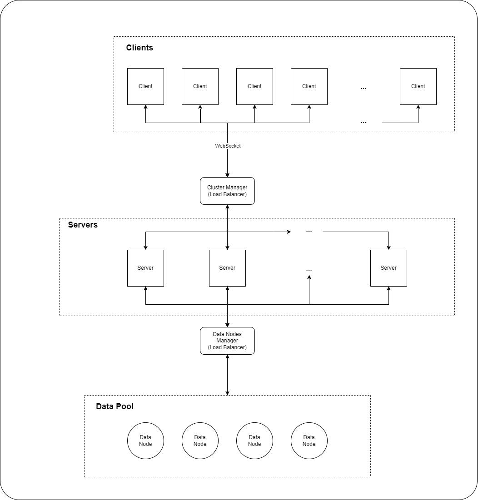

# MyGeoEye
O MyGeoEye é uma solução projetada para demonstrar o potencial de um sistema distribuído que escala horizontalmente, oferecendo um nível superior de serviço em termos de tempo de resposta e qualidade à medida que o número de buscas simultâneas aumenta.

## Rodando o projeto
1. Execute o seguinte comando na pasta root `npm install`
2. Abra o `client.html` a partir do seu navegador de preferência
3. Agora é só usar a aplicação!

## Arquitetura

